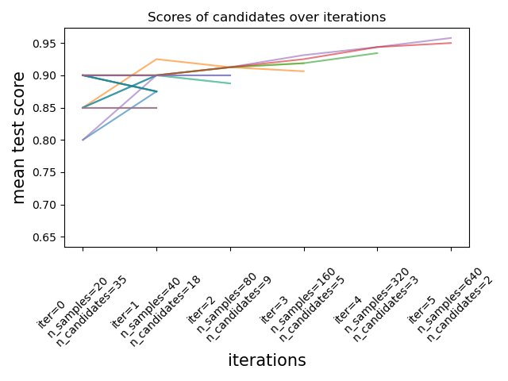

title: Scikit-learn @ SciPy 2021
use_katex: True
class: title-slide

# Scikit-learn @ SciPy 2021


<br>
.larger[Thomas J. Fan]<br>
@thomasjpfan<br>
<a class="this-talk-link", href="https://github.com/thomasjpfan/scipy-2021-scikit-learn-plenary" target="_blank">
This talk on Github: thomasjpfan/scipy-2021-scikit-learn-plenary</a>

---

class: chapter-slide


### Open Source Machine Learning Library for Python

---

# Community Update

- New core developer: Christian Lorentzen (`lorentzenchr`)
- New members to triage team:
    - Norbert Preining (`norbusan`)
    - Sylvain Marié (`smarie`)
    - Julien Jerphanion (`jjerphan`) - hired @ Inria to work on scikit-learn

---

# Community Sprints

.g[
.g-8[
- [Data Umbrella Africa and the Middle East](https://reshamas.github.io/data-umbrella-afme-2021-scikit-learn-sprint-report/): Feb 2021 organized by Reshama Shaikh
- [Scikit-learn Inria Foundation Japan](https://github.com/scikit-learn-inria-fondation/FujitsuSprintMay2021): May 2021 organized by Norbert Preining
- [Data Umbrella Latin America](https://latam2021.dataumbrella.org/): June 2021 organized by Reshama Shaikh
]
.g-4[

]
]
---

class: chapter-slide

## Scikit-learn 0.24 Highlights (December 2020)

.smaller-x[
Abhinav Gupta, Abo7atm, Adam Spannbauer, Adrian Garcia Badaracco, Adrian Sadłocha, Adrin Jalali, adrinjalali, Agamemnon Krasoulis, Akshay Deodhar, Albert Villanova del Moral, Alessandro Gentile, Alessia Marcolini, Alexander Lenail, alexandracraciun, Alexandre Gramfort, Alexandr Fonari, Alex Henrie, Alex Itkes, Alex Liang, alexshacked, Alihan Zihna, Allan D Butler, Amanda Dsouza, amy12xx, Anand Tiwari, Ana Pessoa, Anderson Nelson, Andreas Mueller, Andrew Delong, Ankit Choraria, Archana Subramaniyan, Arthur Imbert, Ashish, Ashutosh Hathidara, Ashutosh Kushwaha, Atsushi Nukariya, Aura Munoz, AutoViz and Auto_ViML, Avi Gupta, Avinash Anakal, Ayako YAGI, Ayush Singh, BaptBillard, barankarakus, barberogaston, beatrizsmg, Benjamin Bossan, Benjamin Pedigo, Ben Mainye, Bharat Raghunathan, Bhavika Devnani, Biprateep Dey, bmaisonn, Bo Chang, Boris Villazón-Terrazas, brigi, Brigitta Sipőcz, Bruno Charron, Byron Smith, Cary Goltermann, Cat Chenal, CeeThinwa, chaitanyamogal, Charles Patel, Chiara Marmo, Christian Kastner, Christian Lorentzen, Christoph Deil, Christopher Yeh, Christos Aridas, Clara Matos, cliffordEmmanuel, clmbst, Coelhudo, Connor Tann, crispinlogan, Cristina Mulas, Daniel López, Daniel Mohns, darioka, Darshan N, david-cortes, Declan O’Neill, Deeksha Madan, dmallia17, EdwinWenink, EL-ATEIF Sara, Elizabeth DuPre, Eric Fiegel, Erich Schubert, Eric Larson, Erin Khoo, Erin R Hoffman, eschibli, Felix Wick, fhaselbeck, flyingdutchman23, Forrest Koch, Fortune Uwha, Francesco Casalegno, Frans Larsson, Gael Varoquaux, Gaurav Desai, Gaurav Sheni, genvalen, Geoffrey Bolmier, Geoffrey Thomas, George Armstrong, George Kiragu, Gesa Stupperich, Ghislain Antony Vaillant, Gim Seng, Gordon Walsh, Gregory R. Lee, Guillaume Chevalier, Guillaume Lemaitre, guiweber, Haesun Park, Hannah Bohle, Hans Moritz Günther, Hao Chun Chang, Harry Scholes, Harry Wei, Harsh Soni, Helder Geovane Gomes de Lima, Henry, Hirofumi Suzuki, Hitesh Somani, Hoda1394, Hugo Le Moine, hugorichard, indecisiveuser, Isaack Mungui, Ishan Mishra, Isuru Fernando, Ivan Wiryadi, iwhalvic, j0rd1smit, Jaehyun Ahn, Jake Tae, James Alan Preiss, James Budarz, James Hoctor, Jan Vesely, Jeevan Anand Anne, Jérémie du Boisberranger, JeroenPeterBos, JHayes, Jianzhu Guo, Jiaxiang, Jie Zheng, Jigna Panchal, jim0421, Jin Li, Joaquin Vanschoren, Joel Nothman, JohanWork, Jona Sassenhagen, Jonathan, Jon Haitz Legarreta Gorroño, Jorge Gorbe Moya, Joseph Lucas, Joshua Newton, Juan Carlos Alfaro Jiménez, Julien Jerphanion, Justin Huber, Kartik Chugh, Katarina Slama, kaylani2, Kei Ishikawa, Kendrick Cetina, Kenny Huynh, Kevin Markham, Kevin Winata, Kiril Isakov, kishimoto, Koki Nishihara, Krum Arnaudov, Kunj, Kyle Kosic, Lauren Oldja, Laurenz Reitsam, Lisa Schwetlick, Loic Esteve, Louis Douge, Louis Guitton, Lucy Liu, Madhura Jayaratne, maikia, Manimaran, Manuel López-Ibáñez, Maren Westermann, Mariam-ke, Maria Telenczuk, Marijn van Vliet, Markus Löning, Martina G. Vilas, Martina Megasari, Martin Hirzel, Martin Scheubrein, Mateusz Górski, Mathieu Blondel, mathschy, mathurinm, Matthias Bussonnier, Max Del Giudice, Mehmet Ali Özer, Miao Cai, Michael, Milan Straka, Muhammad Jarir Kanji, Muoki Caleb, Nadia Tahiri, Ph. D, Naoki Hamada, Neil Botelho, N. Haiat, Nicolas Hug, Nigel Bosch, Nils Werner, Nodar Okroshiashvili, noelano, Norbert Preining, Ogbonna Chibuike Stephen, oj_lappi, Oleh Kozynets, Olivier Grisel, Pankaj Jindal, Pardeep Singh, Parthiv Chigurupati, Patrice Becker, Paulo S. Costa, Pete Green, Peter Dye, pgithubs, Poorna Kumar, Prabakaran Kumaresshan, Probinette4, pspachtholz, putschblos, pwalchessen, Qi Zhang, rachel fischoff, Rachit Toshniwal, Rafey Iqbal Rahman, Rahul Jakhar, Ram Rachum, RamyaNP, ranjanikrishnan, rauwuckl, Ravi Kiran Boggavarapu, Ray Bell, Reshama Shaikh, Richard Decal, RichardScottOZ, Rishi Advani, Rithvik Rao, Rob Romijnders, roei, Romain Tavenard, Roman Yurchak, Ruby Werman, Ryotaro Tsukada, sadak, Saket Khandelwal, Sam, Sam Ezebunandu, Sam Kimbinyi, Samuel Brice, Sandy Khosasi, Sarah Brown, Saurabh Jain, Sean Benhur J, Sean O. Stalley, Sebastian Pölsterl, Sergio, Shail Shah, Shane Keller, Shao Yang Hong, Shashank Singh, shinnar, Shooter23, Shubhanshu Mishra, simonamaggio, Sina Tootoonian, Soledad Galli, Srimukh Sripada, Stephan Steinfurt, Steve Stagg, subrat93, Sunitha Selvan, Swier, SylvainLan, Sylvain Marié, Teon L Brooks, Terence Honles, TFiFiE, Thijs van den Berg, Thomas9292, Thomas J Fan, Thomas J. Fan, Thomas S Benjamin, Thorben Jensen, tijanajovanovic, Timo Kaufmann, t-kusanagi2, tnwei, Tom Dupré la Tour, Trevor Waite, ufmayer, Umberto Lupo, vadim-ushtanit, Vangelis Gkiastas, Venkatachalam N, Vikas Pandey, Vinicius Rios Fuck, Violeta, Vlasovets, waijean, watchtheblur, Wenbo Zhao, willpeppo, xavier dupré, Xethan, xiaoyuchai, Xue Qianming, xun-tang, yagi-3, Yakov Pchelintsev, Yashika Sharma, Yi-Yan Ge, Yosuke KOBAYASHI, Yue Wu, Yutaro Ikeda, yzhenman, Zaccharie Ramzi, Zito, Zito Relova, zoj613, Zhao Feng.
]

---

# Successive Halving for tuning hyper-parameters

```python
from sklearn.experimental import enable_halving_search_cv  # noqa
*from sklearn.model_selection import HalvingRandomSearchCV

*rsh = HalvingRandomSearchCV(estimator=clf, param_distributions=param_dist, factor=2)
rsh.fit(X, y)
```

.center[

]

Find our more in our [User Guide](https://scikit-learn.org/stable/modules/grid_search.html#successive-halving-user-guide)

---

# Native support for categorical features in HistGradientBoosting estimators

```python
from sklearn.experimental import enable_hist_gradient_boosting  # noqa
from sklearn.ensemble import HistGradientBoostingRegressor

hist_native = make_pipeline(
    ordinal_encoder,
    HistGradientBoostingRegressor(
*       random_state=42, categorical_features=categorical_mask))
```

Find our more in our [User Guide](https://scikit-learn.org/stable/modules/ensemble.html#categorical-features-support)

---

# Self-training Meta-Estimator

Supervised classifier can function as a semi-supervised classifier, allowing it to learn from unlabeled data.

```python
*from sklearn.semi_supervised import SelfTrainingClassifier

rng = np.random.RandomState(42)
iris = datasets.load_iris()

random_unlabeled_points = rng.rand(iris.target.shape[0]) < 0.3
iris.target[random_unlabeled_points] = -1

svc = SVC(probability=True, gamma="auto")

*self_training_model = SelfTrainingClassifier(svc)
self_training_model.fit(iris.data, iris.target)
```

Find our more in our [User Guide](https://scikit-learn.org/stable/modules/semi_supervised.html#self-training)

---

# SequentialFeatureSelector

Greedy procedure that iteratively finds the best features

```python
from sklearn.feature_selection import SequentialFeatureSelector

knn = KNeighborsClassifier(n_neighbors=3)

*sfs = SequentialFeatureSelector(knn, n_features_to_select=2)
sfs.fit(X, y)
```

Find our more in our [User Guide](https://scikit-learn.org/stable/modules/feature_selection.html#sequential-feature-selection)

---

# PolynomialCountSketch

Approximates a polynomial expansion

```python
from sklearn.kernel_approximation import PolynomialCountSketch

pipe = make_pipeline(MinMaxScaler(),
*                    PolynomialCountSketch(degree=2, n_components=300),
                     LogisticRegression(max_iter=1000))
```

Find our more in our [User Guide](https://scikit-learn.org/stable/modules/kernel_approximation.html#polynomial-kernel-approximation-via-tensor-sketch)

---

# scikit-learn 0.24 [Changlog](https://scikit-learn.org/dev/whats_new/v0.24.html) 📓

---

class: chapter-slide

# Future Plans 🚀

---

# Consistent naming for loss functions 📉

- **`'squared_error'`** used instead of
    - [`'mse'`, `'ls'`, `'least_squares'`, `'squared_loss'`]

- **`'absolute_error'`** used instead of
    - [`'mae'`, `'lad'`, `'least_absolute_deviation'`, `'absolute_loss'`]

---

# SLEP006 - Metadata routing 🚥

- Passing metadata (e.g. `sample_weight`) to a scorer used in cross-validation
- Passing metadata (e.g. `groups`) to a CV splitter in nested cross-validation
- Passing metadata (e.g. `sample_weight`) to some scorers and not others in multi-metric cross-validation.

---

# Feature Name Support & pandas DataFrames 🐼

- Column name consistency
- API for getting feature names out from any transformer
- **Output pandas dataframes** 🐼

---

class: chapter-slide


# **scikit-learn 1.0** is the next release!
